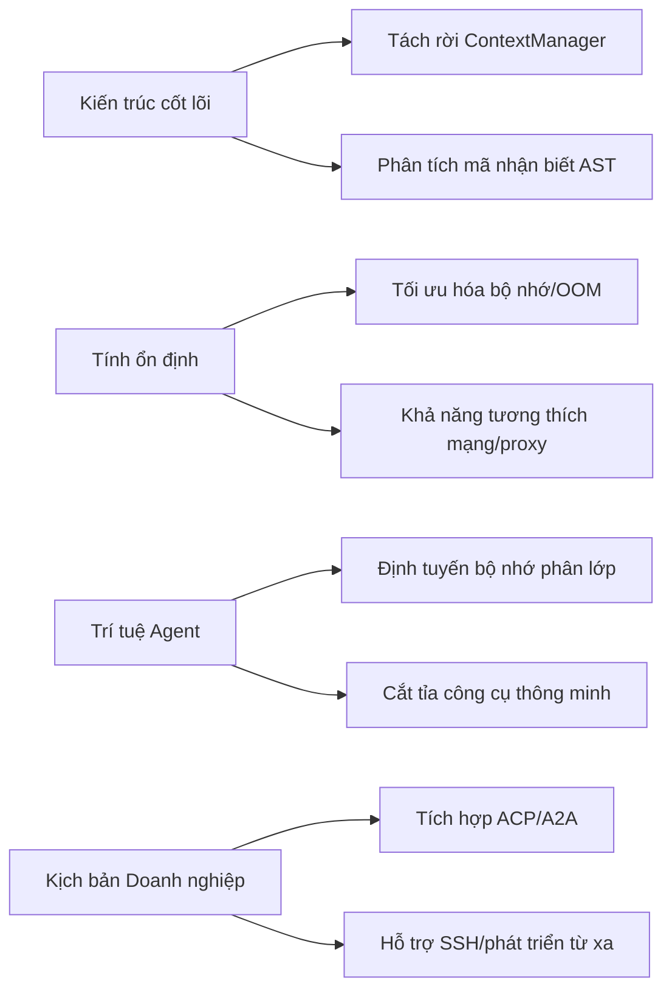

# Nhật báo cộng đồng công cụ AI CLI 2026-04-11

> Thời gian tạo: 2026-04-11 01:50 UTC | Bao phủ công cụ: 8

- [Claude Code](https://github.com/anthropics/claude-code)
- [OpenAI Codex](https://github.com/openai/codex)
- [Gemini CLI](https://github.com/google-gemini/gemini-cli)
- [GitHub Copilot CLI](https://github.com/github/copilot-cli)
- [Kimi Code CLI](https://github.com/MoonshotAI/kimi-cli)
- [OpenCode](https://github.com/anomalyco/opencode)
- [Pi](https://github.com/badlogic/pi-mono)
- [Qwen Code](https://github.com/QwenLM/qwen-code)
- [Claude Code Skills](https://github.com/anthropics/skills)

---

## So sánh ngang

# Báo cáo phân tích so sánh ngang hệ sinh thái công cụ AI CLI | 2026-04-11

---

## 1. Toàn cảnh hệ sinh thái

Hệ sinh thái công cụ AI CLI hiện tại đang có cấu trúc "**một siêu cường, nhiều đối thủ mạnh, phân hóa theo chiều dọc**": Claude Code chiếm lĩnh tâm trí thị trường doanh nghiệp nhờ lợi thế đi đầu, nhưng vấn đề tiêu thụ token và mô hình bị suy giảm năng lực gây ra khủng hoảng niềm tin; OpenAI Codex tạo ra rào cản khác biệt hóa bằng tương tác giọng nói thời gian thực và xây dựng hệ thống định danh Agent; các nhà sản xuất Trung Quốc (Kimi, Qwen) đang nhanh chóng đuổi kịp, hình thành lợi thế cục bộ về quản lý phiên và trải nghiệm TUI; GitHub Copilot CLI dựa vào vị thế hệ sinh thái để chiếm lĩnh thị trường nhưng tốc độ đổi mới chậm lại; các công cụ mới nổi như OpenCode, Pi tìm kiếm đột phá bằng việc hiện đại hóa kiến trúc (Effect/Rust) và trải nghiệm nhà phát triển. Nhìn chung, "**kiểm soát chi phí, tuân thủ doanh nghiệp, nhất quán đa nền tảng**" trở thành ba vấn đề chung mà toàn ngành đang nỗ lực giải quyết.

---

## 2. So sánh mức độ hoạt động của từng công cụ

| Công cụ | Issues (Hoạt động 24h) | PRs (Hoạt động 24h) | Phát hành phiên bản | Động thái quan trọng |
|:---|:---:|:---:|:---|:---|
| **Claude Code** | 50+ | 10+ | v2.1.101 | Lệnh `/team-onboarding` mới; bùng nổ vấn đề tiêu thụ token |
| **OpenAI Codex** | 50+ | 10+ | v0.119.0 | Mặc định hóa giọng nói v2; xếp chồng 4 PR hệ thống định danh Agent |
| **Gemini CLI** | Chưa rõ | 10+ | v0.39.0-nightly | Tái cấu trúc kiến trúc ContextManager; sửa lỗi TLS môi trường proxy/TUN |
| **GitHub Copilot CLI** | 50 | 0 | v1.0.24 | Khủng hoảng kiểm soát quyền doanh nghiệp (#223) và khả năng tương thích MCP (#2498) |
| **Kimi CLI** | 10 | 10 | v1.31.0 | Chế độ YOLO vào Web UI; hiển thị biểu đồ Mermaid |
| **OpenCode** | 10+ | 10+ | Không có | Tái cấu trúc kiến trúc Effect (hủy 3 facade); chậm trong việc thích ứng Gemma 4 |
| **Pi** | 20 | 6 | Không có | Giám sát quá thời gian chờ luồng; sửa lỗi nghiêm trọng quản lý vòng đời phiên |
| **Qwen Code** | 20+ | 15+ | v0.14.3 | Quản lý phiên đặt tên `/chat`; theo dõi đóng góp AI |

> **Lưu ý**: Số lượng Issues/PRs là ước tính dựa trên mô tả báo cáo hàng ngày, một số công cụ chưa cung cấp số liệu thống kê chính xác 24 giờ.

---

## 3. Hướng chức năng được quan tâm chung

| Hướng chức năng | Công cụ liên quan | Yêu cầu cụ thể | Mức độ khẩn cấp |
|:---|:---|:---|:---|
| **Kiểm soát chi phí và minh bạch sử dụng** | Claude Code, OpenAI Codex, GitHub Copilot CLI | Tăng đột biến tiêu thụ token/yêu cầu, hộp đen thanh toán, giới hạn cứng hạn ngạch | 🔴 P0 |
| **Quản lý vòng đời phiên** | Kimi CLI, Qwen Code, Pi, Claude Code | Lưu tên, khôi phục nhanh, chuyển đổi giữa các dự án, trạng thái nhất quán sau nén | 🔴 P0 |
| **Hiệu suất và ổn định TUI** | Qwen Code, Gemini CLI, Claude Code, OpenCode | Lỗi cuộn ngữ cảnh dài, nhấp nháy, độ trễ khởi động, tương thích đầu cuối | 🟡 P1 |
| **Quyền và tuân thủ cấp doanh nghiệp** | GitHub Copilot CLI, OpenAI Codex, Claude Code | Khả năng hiển thị quyền Token Org, proxy TLS, chính sách sandbox, theo dõi kiểm toán | 🟡 P1 |
| **Khả năng tương thích hệ sinh thái MCP** | GitHub Copilot CLI, OpenAI Codex, Claude Code | Đăng ký máy chủ, lọc tham số HTML, phân tích $ref, tải lại nóng | 🟡 P1 |
| **Nhất quán trải nghiệm đa nền tảng** | Kimi CLI, Qwen Code, OpenAI Codex | Căn chỉnh chức năng Web/CLI/IDE, chế độ YOLO, hành vi phím tắt thống nhất | 🟢 P2 |

---

## 4. Phân tích định vị khác biệt

| Công cụ | Trọng tâm chức năng cốt lõi | Hồ sơ người dùng mục tiêu | Đặc điểm lộ trình kỹ thuật |
|:---|:---|:---|:---|
| **Claude Code** | Nhiệm vụ kỹ thuật phức tạp, hợp tác nhóm (`/team-onboarding`), cấu hình proxy doanh nghiệp | Nhóm phát triển doanh nghiệp vừa và lớn, kỹ sư cần hiểu sâu về kho mã nguồn | Sản phẩm thương mại mã nguồn đóng, năng lực mô hình phụ thuộc dòng Claude, kiến trúc hộp đen |
| **OpenAI Codex** | Tương tác giọng nói thời gian thực, hệ thống định danh Agent, môi trường thực thi từ xa | Người dùng đầu tiên theo đuổi trải nghiệm tương tác tiên tiến, nhà phát triển cần hợp tác đa thiết bị | Đang viết lại bằng Rust, nhấn mạnh kiến trúc proxy an toàn và đáng tin cậy, ràng buộc hệ sinh thái OpenAI |
| **Gemini CLI** | Điều phối Agent con, phân tích mã nhận biết AST, tích hợp hệ sinh thái Google | Người dùng Google Cloud, các tình huống cần phân tích kho mã nguồn quy mô lớn | Tách rời kiến trúc (ContextManager/Sidecar), nhấn mạnh khả năng mở rộng |
| **GitHub Copilot CLI** | Tích hợp liền mạch IDE, quy trình làm việc gốc GitHub, quản trị cấp tổ chức | Người dùng nặng GitHub đã đăng ký Copilot, ưu tiên tuân thủ doanh nghiệp | Dựa trên hệ sinh thái VS Code, MCP làm cơ chế mở rộng, tốc độ đổi mới thận trọng |
| **Kimi CLI** | Trải nghiệm nhà phát triển Trung Quốc, hai đầu Web UI và CLI, tối ưu hóa nhạy cảm chi phí | Nhà phát triển Trung Quốc, các tình huống xử lý văn bản dài cần hỗ trợ địa phương hóa | Lặp lại nhanh, chú trọng chi tiết tương tác (Mermaid, Web hóa YOLO) |
| **OpenCode** | Ưu tiên mô hình cục bộ (Ollama), kiến trúc Effect, an toàn kiểu | Người dùng nhạy cảm về quyền riêng tư, người yêu lập trình hàm, người ủng hộ AI cục bộ | Kiến trúc hàm thuần túy TypeScript/Effect, nhấn mạnh khả năng kết hợp và kiểm thử |
| **Pi** | Giao diện thống nhất đa mô hình, hệ sinh thái mở rộng, quản lý phiên chi tiết | Nhà phát triển chuyên nghiệp cần chuyển đổi linh hoạt giữa các mô hình của nhiều nhà cung cấp, tích hợp chuỗi công cụ | Lớp trừu tượng nhẹ, thích ứng nhanh với thay đổi API của từng nhà cung cấp, tối ưu hóa thời gian chạy Bun |
| **Qwen Code** | Hệ sinh thái Alibaba Cloud, đổi mới tương tác gốc AI, khởi đầu quốc tế hóa | Nhà phát triển Trung Quốc, các tình huống cần tích hợp sâu với mô hình Tongyi Qianwen | Tích cực học hỏi từ đối thủ cạnh tranh (iflow `/chat`), nhấn mạnh lặp lại chức năng dựa vào cộng đồng |

---

## 5. Mức độ phổ biến và sự trưởng thành của cộng đồng

### Mức độ hoạt động cao + Sự trưởng thành cao (Nhóm đầu tiên)
| Công cụ | Bằng chứng | Dấu hiệu trưởng thành |
|:---|:---|:---|
| **Claude Code** | Issue nóng nhất năm #42796 (262 bình luận/1213 👍), liên tục cung cấp chức năng doanh nghiệp | Trưởng thành về mặt thương mại, nhưng sự suy giảm năng lực mô hình gây biến động niềm tin |
| **OpenAI Codex** | Vấn đề token #14593 với 500+ bình luận, hệ thống định danh Agent xếp chồng 4 PR | Đang nâng cấp kiến trúc cấp cơ sở hạ tầng, giai đoạn xây dựng năng lực cấp doanh nghiệp |

### Mức độ hoạt động cao + Lặp lại nhanh (Nhóm thứ hai)
| Công cụ | Bằng chứng | Giai đoạn phát triển |
|:---|:---|:---|
| **Qwen Code** | 15+ PRs trong một ngày, phản hồi nhanh chức năng `/chat` theo cộng đồng #3025 | Giai đoạn đuổi kịp chức năng, đặc điểm rõ ràng dựa vào cộng đồng |
| **Pi** | 20 Issues + 6 PRs đóng vòng lặp hoàn chỉnh trong 24 giờ, sửa chữa hạ tầng dày đặc | Giai đoạn tăng cứng kỹ thuật, ưu tiên sự ổn định |
| **Gemini CLI** | Loạt PR tái cấu trúc ContextManager, EPIC nhận biết AST | Giai đoạn hiện đại hóa kiến trúc, dọn dẹp nợ kỹ thuật |

### Mức độ hoạt động trung bình + Khám phá khác biệt hóa (Nhóm thứ ba)
| Công cụ | Bằng chứng | Đặc điểm phát triển |
|:---|:---|:---|
| **Kimi CLI** | Tốc độ phiên bản ổn định, trau chuốt trải nghiệm hai đầu Web/CLI | Giai đoạn hoàn thiện sản phẩm, tìm kiếm sự khác biệt về trải nghiệm |
| **OpenCode** | Mức độ minh bạch cao của tái cấu trúc Effect, chậm trong việc thích ứng Gemma 4 | Thúc đẩy bởi niềm tin vào kiến trúc, cần nâng cao tính hoàn chỉnh của chức năng |

### Mức độ hoạt động thấp + Chiếm lĩnh vị thế hệ sinh thái (Nhóm thứ tư)
| Công cụ | Bằng chứng | Cảnh báo rủi ro |
|:---|:---|:---|
| **GitHub Copilot CLI** | 0 PR cập nhật trong 24 giờ, phản hồi Issue phụ thuộc vào nhóm cốt lõi | Động lực đổi mới không đủ, khủng hoảng tương thích MCP cần giải quyết |

---

## 6. Tín hiệu xu hướng đáng chú ý

| Tín hiệu xu hướng | Bằng chứng nguồn | Giá trị tham khảo cho nhà phát triển |
|:---|:---|:---|
| **Hệ thống định danh Agent trở thành tiêu chuẩn doanh nghiệp** | OpenAI Codex 4 PR xếp chồng (#17385-17388), quản lý vòng đời phiên của Pi | Kiểm toán quyền, theo dõi nhiệm vụ cho các tình huống hợp tác đa Agent sẽ trở thành nhu cầu tuân thủ bắt buộc, người dùng đầu tiên có thể theo dõi giải pháp triển khai |
| **Khủng hoảng chi phí token thúc đẩy thiết kế "ý thức sử dụng"** | Claude Code #38239/#42272, Copilot CLI #2591 (80-100 lần/phiên), cơ chế nén Qwen khi không hoạt động | Khi đánh giá công cụ cần chú ý: ① Mức độ minh bạch đo lường theo hạt của yêu cầu ② Chiến lược nén ngữ cảnh ③ Khả năng giới hạn cứng ngân sách |
| **MCP từ "mở rộng chức năng" thành "chiến trường tương thích"** | Copilot CLI GHE 404 (#2498), Claude Code Firecrawl kết nối thất bại (#46472) | Khả năng thích ứng mạng doanh nghiệp của máy chủ MCP, khả năng tương thích Schema sẽ trở thành chi phí tích hợp quan trọng, khuyến nghị ưu tiên chọn công cụ được chứng nhận chính thức |
| **Hiệu suất TUI trở thành rào cản khác biệt hóa** | Qwen #2950 (cuộn điên cuồng), Gemini #24470 (nhấp nháy), Claude #36582 (cuộn tự động lên đầu) | Trong các tình huống ngữ cảnh dài, kho mã nguồn lớn, hiệu suất hiển thị đầu cuối ảnh hưởng trực tiếp đến khả năng sử dụng, giải pháp Rust/gốc (Codex) có thể chiếm ưu thế |
| **Quản lý phiên kiểu "không gian tên" trở thành sự đồng thuận** | Qwen `/chat`, Kimi #1814, Pi #3021 | Nâng cấp nhận thức từ "lịch sử hội thoại" lên "không gian làm việc dự án", nhắc nhở nhà phát triển thiết kế lại quy trình làm việc được hỗ trợ bởi AI |
| **Quyền đóng góp AI mở ra một chiều cạnh tuân thủ mới** | Qwen #3115 (theo dõi đóng góp mã AI) | Dự án mã nguồn mở và doanh nghiệp cần lên kế hoạch trước cho chiến lược tiết lộ nội dung do AI tạo ra, quy trình kiểm toán khả năng tương thích giấy phép |

---

*Báo cáo dựa trên động thái cộng đồng của từng công cụ vào ngày 2026-04-11, dữ liệu được lấy từ kho lưu trữ GitHub công khai*

---

## Báo cáo chi tiết từng công cụ

<details>
<summary><strong>Claude Code</strong> — <a href="https://github.com/anthropics/claude-code">anthropics/claude-code</a></summary>

## Điểm nóng cộng đồng Claude Code Skills

> Nguồn dữ liệu: [anthropics/skills](https://github.com/anthropics/skills)

 # Báo cáo điểm nóng cộng đồng Claude Code Skills (Tính đến ngày 2026-04-11)

## 1. Xếp hạng Skills Nóng (theo mức độ quan tâm của cộng đồng)

| Hạng | Skill | Mô tả chức năng | Trạng thái | Điểm thảo luận chính |
|:---|:---|:---|:---|:---|
| 1 | **[document-typography](https://github.com/anthropics/skills/pull/514)** | Kiểm soát chất lượng sắp xếp văn bản do AI tạo ra (kiểm soát cô đơn, widow đoạn văn, căn chỉnh số) | 🟡 Mở | Ảnh hưởng trực tiếp đến chất lượng đầu ra của tất cả văn bản Claude, giải quyết điểm yếu về sắp xếp bị bỏ qua từ lâu |
| 2 | **[skill-quality-analyzer](https://github.com/anthropics/skills/pull/83)** + **[skill-security-analyzer](https://github.com/anthropics/skills/pull/83)** | Đánh giá chất lượng Skill năm chiều (cấu trúc/tài liệu/kiểm thử/bảo mật/hiệu suất) và kiểm toán bảo mật | 🟡 Mở | Mô hình meta-skill, lấp đầy khoảng trống quản trị chất lượng của chính Skill |
| 3 | **[Xử lý ODT](https://github.com/anthropics/skills/pull/486)** | Tạo văn bản OpenDocument, điền mẫu và phân tích cú pháp ODT→HTML | 🟡 Mở | Khoảng trống quan trọng trong quy trình làm việc tài liệu doanh nghiệp, hỗ trợ định dạng tiêu chuẩn ISO |
| 4 | **[SAP-RPT-1-OSS](https://github.com/anthropics/skills/pull/181)** | Tích hợp phân tích dự đoán của mô hình cơ sở bảng mã nguồn mở SAP | 🟡 Mở | Skill ERP/BI cấp doanh nghiệp đầu tiên, kết nối Claude với hệ sinh thái dữ liệu SAP |
| 5 | **[shodh-memory](https://github.com/anthropics/skills/pull/154)** | Hệ thống bộ nhớ bền vững liên phiên Agent AI | 🟡 Mở | Giải quyết điểm yếu cốt lõi về mất trạng thái của Claude Code, tính liên tục của ngữ cảnh |
| 6 | **[testing-patterns](https://github.com/anthropics/skills/pull/723)** | Các mẫu kiểm thử toàn diện (kiểm thử đơn vị, kiểm thử thành phần React, E2E, hiệu suất) | 🟡 Mở | Triển khai mô hình giải thưởng kiểm thử, nhu cầu cứng cho quy trình làm việc phát triển |
| 7 | **[x402 BSV](https://github.com/anthropics/skills/pull/374)** | Xác minh thanh toán vi mô blockchain BSV và thanh toán dịch vụ AI | 🟡 Mở | Tích hợp thanh toán mã hóa gốc, khám phá giao thức tiền tệ hóa dịch vụ AI |
| 8 | **[frontend-design](https://github.com/anthropics/skills/pull/210)** | Tái cấu trúc độ rõ ràng và khả năng thực thi của Skill thiết kế giao diện người dùng | 🟡 Mở | Ví dụ quản trị Skill hiện có, chuyển từ "tài liệu" sang "chỉ dẫn thực thi" |

---

## 2. Xu hướng nhu cầu cộng đồng (Tổng hợp từ Issues)

| Xu hướng | Issue đại diện | Nhu cầu cốt lõi |
|:---|:---|:---|
| **🔐 Bảo mật và Quản trị** | [#492](https://github.com/anthropics/skills/issues/492) Lạm dụng ranh giới tin cậy, [#412](https://github.com/anthropics/skills/issues/412) Mô hình quản trị Agent | Rủi ro bảo mật của các Skill giả mạo không gian tên chính thức của cộng đồng; chính sách thực thi, phát hiện mối đe dọa, theo dõi kiểm toán cho hệ thống Agent cấp doanh nghiệp |
| **🏢 Tích hợp và Triển khai Doanh nghiệp** | [#29](https://github.com/anthropics/skills/issues/29) Hỗ trợ AWS Bedrock, [#228](https://github.com/anthropics/skills/issues/228) Chia sẻ Skill cấp tổ chức | Triển khai bên thứ ba bên ngoài hệ sinh thái gốc Claude; cơ chế phân phối Skill trong nhóm/doanh nghiệp (không phải truyền tệp thủ công qua Slack) |
| **🛠️ Trải nghiệm Nhà phát triển và Chuỗi công cụ** | [#202](https://github.com/anthropics/skills/issues/202) Tối ưu hóa skill-creator thành thực tiễn tốt nhất, [#556](https://github.com/anthropics/skills/issues/556) Công cụ đánh giá bị lỗi | Công cụ tạo Skill chuyển từ "hướng dẫn giảng dạy" sang "thực thi hiệu quả"; độ tin cậy của cơ chế đánh giá và kích hoạt tự động |
| **📦 Chuẩn hóa Hệ sinh thái** | [#16](https://github.com/anthropics/skills/issues/16) Skill làm lộ giao thức MCP, [#189](https://github.com/anthropics/skills/issues/189) Cài đặt plugin trùng lặp | Tương tác lẫn nhau giữa Skill và giao thức MCP; chuẩn hóa không gian tên và quản lý phụ thuộc |
| **🐛 Ổn định Nền tảng** | [#62](https://github.com/anthropics/skills/issues/62) Skill bị mất, [#406](https://github.com/anthropics/skills/issues/406) Lỗi 500 khi tải lên, [#403](https://github.com/anthropics/skills/issues/403) Lỗi khi xóa | Tính bền vững dữ liệu môi trường sản xuất và độ tin cậy của API |

---

## 3. Skills có tiềm năng cao đang chờ hợp nhất (Bình luận hoạt động + Cập nhật gần đây)

| Skill | Liên kết PR | Điểm nổi bật | Rủi ro/Trở ngại |
|:---|:---|:---|:---|
| **record-knowledge** | [#521](https://github.com/anthropics/skills/pull/521) | Giải quyết vấn đề mất ngữ cảnh "hôm qua phát hiện hôm nay quên" của Claude, lưu trữ bền vững `.claude/knowledge/entries/` | Cần phối hợp với lộ trình chức năng bộ nhớ chính thức |
| **codebase-inventory-audit** | [#147](https://github.com/anthropics/skills/pull/147) | Quy trình làm việc hệ thống hóa 10 bước để làm sạch kho mã nguồn, quản trị nợ kỹ thuật | Sự cân bằng giữa tính phổ quát và ngăn xếp công nghệ cụ thể |
| **masonry-generate-image-and-videos** | [#335](https://github.com/anthropics/skills/pull/335) | Tạo đa phương tiện Imagen 3.0 + Veo 3.1, tích hợp CLI Masonry | Kiểm soát chi phí và phụ thuộc API bên ngoài |
| **sensory** | [#806](https://github.com/anthropics/skills/pull/806) | Tự động hóa macOS gốc bằng AppleScript, thay thế tương tác dựa trên ảnh chụp màn hình | Trải nghiệm người dùng cấp quyền (Tier 2 Accessibility) |
| **Sửa lỗi tracked change docx** | [#541](https://github.com/anthropics/skills/pull/541) | Sửa lỗi làm hỏng tài liệu do xung đột đánh dấu trang và ID sửa đổi | Sửa chữa nợ kỹ thuật, ít trở ngại hợp nhất |

---

## 4. Nhận định về hệ sinh thái Skills

> **Mâu thuẫn cốt lõi: Cộng đồng chuyển từ "mở rộng chức năng" sang "tin cậy và quản trị"** - Các PR ban đầu tập trung vào năng lực công cụ đơn lẻ (PDF, ODT, kiểm thử), các chủ đề có độ nóng gần đây tập trung vào ranh giới bảo mật (#492), tuân thủ doanh nghiệp (#412), độ tin cậy của nền tảng (#62, #406) và chuẩn hóa hệ sinh thái (tương tác MCP #16). Người tạo Skill chuyển từ nhà phát triển cá nhân sang nhóm doanh nghiệp, thúc đẩy nhu cầu cứng về chia sẻ cấp tổ chức, khả năng tương thích SSO, theo dõi kiểm toán, trong khi độ trưởng thành của chuỗi công cụ skill-creator tụt hậu so với quy mô mở rộng của cộng đồng.

---

*Nguồn dữ liệu: Kho lưu trữ GitHub anthropics/skills, thời gian lấy mẫu PR/Issue 2026-04-11*

---

 # Nhật báo động thái cộng đồng Claude Code | 2026-04-11

## 1. Tổng quan hôm nay

Anthropic hôm nay đã phát hành phiên bản **v2.1.101**, bổ sung lệnh `/team-onboarding` mới có thể tạo hướng dẫn làm quen cho nhân viên mới dựa trên thói quen sử dụng cục bộ và mặc định hóa lưu trữ chứng chỉ CA hệ thống để giải quyết các vấn đề proxy TLS của doanh nghiệp. Issue được cộng đồng quan tâm cao #42796 về "nhiệm vụ kỹ thuật phức tạp không khả dụng sau bản cập nhật tháng 2" hôm nay đã chính thức đóng lại, với tổng cộng 262 bình luận, 1213 lượt 👍, phản ánh vấn đề mô hình bị suy giảm năng lực vẫn là điểm yếu lớn nhất của cộng đồng. Đồng thời, việc tiêu thụ token bất thường (#38239, #37917, #42272) trở thành điểm bùng phát tập trung của các Issues mới được thêm vào hôm nay.

---

## 2. Phát hành phiên bản

### [v2.1.101](https://github.com/anthropics/claude-code/releases/tag/v2.1.101) | 2026-04-11

| Mục cập nhật | Mô tả |
|--------|------|
| `/team-onboarding` | Lệnh mới, tự động tạo hướng dẫn làm quen cho thành viên nhóm dựa trên hồ sơ sử dụng Claude Code cục bộ |
| Tối ưu hóa proxy TLS doanh nghiệp | Mặc định tin cậy kho lưu trữ chứng chỉ CA hệ thống, không cần cấu hình thêm; có thể quay lại chỉ chứng chỉ được bó bằng cách sử dụng `CLAUDE_CODE_CERT_STORE=bundled` |
| `/ultrapl...` | Nội dung cập nhật bị cắt bớt, chức năng cụ thể đang chờ thông báo phát hành đầy đủ |

**Phiên bản trước** [v2.1.100](https://github.com/anthropics/claude-code/releases/tag/v2.1.100) không cung cấp nhật ký thay đổi chi tiết.

---

## 3. Issues cộng đồng nóng

| # | Tiêu đề | Trạng thái | Dữ liệu chính | Điểm cốt lõi |
|---|------|------|---------|---------|
| [#42796](https://github.com/anthropics/claude-code/issues/42796) | Nhiệm vụ kỹ thuật phức tạp không khả dụng sau bản cập nhật tháng 2 | **Đã đóng** | 🔥 262 bình luận / 1213 👍 | **Một trong những Issue nóng nhất năm**. Người dùng phản hồi mô hình giảm sút nghiêm trọng trong các nhiệm vụ kỹ thuật phức tạp, cuối cùng chính thức đóng lại mà không có giải pháp rõ ràng, làn sóng nghi ngờ trong cộng đồng mạnh mẽ |
| [#38239](https://github.com/anthropics/claude-code/issues/38239) | Tốc độ tiêu thụ Token cực nhanh, quản lý hạn ngạch có vấn đề nghiêm trọng | Mở | 63 bình luận / 56 👍 | **Tín hiệu khủng hoảng chi phí**. Nhiều người dùng báo cáo tính toán Token bất thường, có thể liên quan đến lỗ hổng thanh toán |
| [#36582](https://github.com/anthropics/claude-code/issues/36582) | Cuộn tự động lên đầu đầu cuối khi hội thoại dài | Mở | 38 bình luận / 122 👍 | Điểm yếu cứng của trải nghiệm TUX, ảnh hưởng đến quy trình làm việc mã hóa dài |
| [#10181](https://github.com/anthropics/claude-code/issues/10181) | Chạy công cụ Bash trên Linux cực kỳ chậm | Mở | 36 bình luận / 34 👍 | Vấn đề suy giảm hiệu suất, giới thiệu trong v2.0.22, chưa được sửa chữa lâu dài |
| [#32870](https://github.com/anthropics/claude-code/issues/32870) | Kích hoạt màn hình xanh (BSOD) khi liệt kê thư mục trên Windows | Mở | 24 bình luận | **Rủi ro ổn định cấp hệ thống**, nguyên nhân BSOD cần được điều tra |
| [#37917](https://github.com/anthropics/claude-code/issues/37917) | Vấn đề sử dụng tăng đột biến | Mở | 23 bình luận / 45 👍 | Hình thành cụm vấn đề tiêu thụ Token với #38239 |
| [#31537](https://github.com/anthropics/claude-code/issues/31537) | Số dư hiển thị không đủ sau khi nạp tiền | Mở | 18 bình luận / 8 👍 | Khủng hoảng niềm tin vào hệ thống thanh toán |
| [#36485](https://github.com/anthropics/claude-code/issues/36485) | Ứng dụng máy tính để bàn Mac không phản hồi gửi tin nhắn, màn hình trắng | Mở | 17 bình luận / 9 👍 | Vấn đề ổn định đầu cuối |
| [#42272](https://github.com/anthropics/claude-code/issues/42272) | Tiêu thụ Token quá cao sau v2.1.88 — 2 vấn đề tiêu thụ 66% hạn ngạch | Mở | 15 bình luận / 9 👍 | **Hồi quy cụ thể theo phiên bản**, bất thường khi kết hợp Max 5x + Opus 4.6 |
| [#2054](https://github.com/anthropics/claude-code/issues/2054) | Phím Enter xuống dòng thay vì gửi tin nhắn | Mở | 14 bình luận / 64 👍 | Nhu cầu cao của người dùng CJK, tối ưu hóa trải nghiệm nhập liệu |

---

## 4. Tiến độ PR quan trọng

| # | Tiêu đề | Trạng thái | Đóng góp cốt lõi | Giá trị kỹ thuật |
|---|------|------|---------|---------|
| [#28714](https://github.com/anthropics/claude-code/pull/28714) | Phân loại Issue tự động và tóm tắt báo cáo hàng tuần dựa trên API Claude | Mở | Phân loại Issue đơn Haiku 4.5 (~$0.001), tạo báo cáo hàng tuần Sonnet 4.6 (~$0.05/tuần) | **Cơ sở hạ tầng quản trị cộng đồng**, giải pháp vận hành tự động chi phí thấp |
| [#41447](https://github.com/anthropics/claude-code/pull/41447) | Mã nguồn mở Claude Code ✨ | Mở | Đóng #59, #456, #2846, #22002, #41434 | **Yêu cầu cộng đồng mang tính biểu tượng**, theo dõi lâu dài tiếng gọi mã nguồn mở |
| [#46351](https://github.com/anthropics/claude-code/pull/46351) | Kích hoạt hỗ trợ công cụ PowerShell trên macOS/Linux | Mở | Loại bỏ giới hạn chỉ dành cho Windows, kích hoạt bằng `CLAUDE_CODE_USE_POWERSHELL_TOOL=1` | Tính nhất quán đa nền tảng, tin vui cho người dùng PowerShell 7.5+ |
| [#32980](https://github.com/anthropics/claude-code/pull/32980) | Lệnh `/create-test` mới và plugin | **Đã hợp nhất** | Tự động tạo tệp kiểm thử đơn vị từ phân tích mã nguồn | Tăng cường quy trình làm việc kiểm thử theo hướng dẫn |
| [#32979](https://github.com/anthropics/claude-code/pull/32979) | Plugin `/explain-architecture` mới | **Đã hợp nhất** | Phân tích câu lệnh nhập để xây dựng biểu đồ phụ thuộc mô-đun, xuất Mermaid/PlantUML/JSON | Trực quan hóa mã và tự động hóa tài liệu kiến trúc |
| [#45621](https://github.com/anthropics/claude-code/pull/45621) | Plugin `notify-on-complete` mới | Mở | Cơ chế hook dừng, thông báo cho người dùng khi phản hồi của Claude hoàn tất | Tối ưu hóa trải nghiệm quy trình làm việc không đồng bộ |
| [#39148](https://github.com/anthropics/claude-code/pull/39148) | Plugin `preserve-session`: lịch sử phiên không phụ thuộc vào đường dẫn | Mở | Bảo toàn lịch sử phiên khi đổi tên/di chuyển/sao chép dự án, định danh dự án bằng UUID | Nâng cao độ mạnh mẽ của quản lý phiên |
| [#29461](https://github.com/anthropics/claude-code/pull/29461) | Giới hạn các đề xuất trùng lặp với Issues mở được chuẩn hóa | Mở | Ràng buộc đề xuất của robot phát hiện trùng lặp, giảm nhiễu và trích dẫn vòng tròn | Quản trị chất lượng Issue cộng đồng |
| [#20448](https://github.com/anthropics/claude-code/pull/20448) | Plugin `web4-governance` mới (quy trình làm việc R6) | Mở | Khung quản trị AI cho tensor tin cậy T3, bằng chứng thực thể, theo dõi kiểm toán R6 | Thí nghiệm khái niệm tiên tiến, thử nghiệm giao thức quản trị phi tập trung "Web4" |
| [#38105](https://github.com/anthropics/claude-code/pull/38105) | Plugin kênh WhatsApp mới | Mở | Tích hợp Claude Code với WhatsApp (đã di chuyển sang kho riêng) | Mở rộng tương tác đa kênh, chú ý bảo trì độc lập sau khi bị gỡ bỏ DMCA |

---

## 5. Xu hướng nhu cầu chức năng

Dựa trên phân tích 50 Issues hôm nay, trọng tâm chú ý của cộng đồng thể hiện **ba cụm** chính:

```
┌─────────────────────────────────────────────────────────┐
│  🔴 Kiểm soát chi phí và quản lý hạn ngạch (Khẩn cấp)      │
│     • Tiêu thụ Token tăng đột biến (#38239, #37917, #42272, #45515) │
│     • Minh bạch thanh toán và vấn đề hiển thị số dư (#31537)     │
│     → Nhu cầu: Giám sát sử dụng chi tiết, cảnh báo tiêu thụ bất thường, giới hạn cứng hạn ngạch        │
├─────────────────────────────────────────────────────────┤
│  🟡 Ổn định và Hiệu suất (Liên tục)                          │
│     • Vấn đề cuộn TUI trong hội thoại dài (#36582)                     │
│     • Thực thi công cụ Linux chậm (#10181)                            │
│     • BSOD Windows (#32870), màn hình trắng đầu cuối (#36485)         │
│     • Suy giảm hiệu suất 10-20 lần (#46489)                           │
│     → Nhu cầu: Kiểm thử hồi quy hiệu suất, đảm bảo tính nhất quán đa nền tảng, duy trì trạng thái phiên   │
├─────────────────────────────────────────────────────────┤
│  🟢 Tăng cường trải nghiệm tương tác (Tăng trưởng)                      │
│     • Hành vi phím Enter tùy chỉnh (#2054, nhu cầu cao của người dùng CJK)            │
│     • Chức năng /buddy cố định hóa (#45612, lời kêu gọi giữ lại chức năng Cá tháng Tư)       │
│     • Bàn làm việc bền vững (#46484)                                |
│     • Bộ nhớ cấp dự án (#41918)                                 │
│     → Nhu cầu: Phím tắt tùy chỉnh, lưu bố cục không gian làm việc, tăng cường bộ nhớ ngữ cảnh     │
└─────────────────────────────────────────────────────────┘
```

**Tín hiệu mới nổi**: Các vấn đề tích hợp MCP (Model Context Protocol) bắt đầu xuất hiện (kết nối Firecrawl thất bại #46472, chặn phân loại đầu cuối Chrome #46491), những thách thức về khả năng tương thích trong quá trình mở rộng hệ sinh thái đáng được chú ý.

---

## 6. Điểm thu hút nhà phát triển

### Ma trận điểm yếu

| Mức độ ưu tiên | Lĩnh vực vấn đề | Phản hồi điển hình | Phạm vi ảnh hưởng |
|--------|--------|---------|---------|
| P0 | **Kiểm soát chi phí mất kiểm soát** | "2 vấn đề đơn giản tiêu thụ 66% ngân sách phiên" (#42272), "cùng một máy tính, hai tài khoản chênh lệch 22K Token" (#45515) | Người dùng trả phí trên mọi nền tảng |
| P1 | **Suy giảm cảm nhận năng lực mô hình** | "Nhiệm vụ kỹ thuật phức tạp không khả dụng" (nghi ngờ vẫn tồn tại sau khi đóng #42796) | Nhà phát triển cao cấp |
| P1 | **Khoảng cách trải nghiệm Windows** | BSOD, mã hóa ký tự lộn xộn (#46486), tranh chấp khóa tệp (#46482), lỗi thời VM Cowork (#46487) | Người dùng chuyên nghiệp Windows |
| P2 | **Thích ứng Doanh nghiệp/Nhóm** | Proxy TLS đã được giảm nhẹ (v2.1.101), nhưng nhu cầu chức năng cấp nhóm (ngày hôm nay `/team-onboarding`) đang tiếp tục tăng | Triển khai doanh nghiệp |
| P2 | **Khả năng mở rộng** | PR hệ sinh thái plugin hoạt động mạnh (báo cáo tuần này 10+ PR), nhưng độ ổn định kết nối MCP cần xác minh | Người dùng đầu tiên |

### Chỉ số cảm xúc hôm nay

- 😤 **Lo lắng**: Bùng nổ cụm vấn đề tiêu thụ Token, người dùng nghi ngờ tính công bằng của thanh toán
- 😐 **Chờ đợi**: Cách đóng Issue #42796 gây ra cuộc thảo luận về việc "vấn đề có thực sự được giải quyết không"
- 🎉 **Mong đợi**: Lệnh `/team-onboarding` và việc cố định hóa `/buddy` phản ánh chức năng hợp tác nhóm được ưa chuộng
- 🔧 **Tham gia**: PR plugin hoạt động mạnh, người đóng góp cộng đồng tích cực mở rộng ranh giới chức năng

---

*Báo cáo hàng ngày dựa trên dữ liệu công khai GitHub, không đại diện cho lập trường chính thức của Anthropic.*
*Đăng ký cập nhật: Theo dõi [anthropics/claude-code](https://github.com/anthropics/claude-code)*

</details>

<details>
<summary><strong>OpenAI Codex</strong> — <a href="https://github.com/openai/codex">openai/codex</a></summary>

# Nhật báo động thái cộng đồng OpenAI Codex | 2026-04-11

---

## 1. Tổng quan hôm nay

Hôm nay, Codex đã phát hành **phiên bản chính thức v0.119.0**, mang đến các cập nhật lớn như mặc định hóa đường dẫn WebRTC cho phiên thoại thời gian thực v2, hỗ trợ MCP Apps, v.v. Cộng đồng tiếp tục tập trung vào **tiêu thụ token bất thường** (#14593 đã vượt 500 bình luận) và **vấn đề quyền sandbox**, đồng thời nhóm phát triển đang tích cực đẩy mạnh nâng cấp kiến trúc nền tảng như **hệ thống định danh Agent** (4 PR xếp chồng) và **môi trường thực thi từ xa**.

---

## 2. Phát hành phiên bản

### v0.119.0 (Phiên bản chính thức)
| Thuộc tính | Nội dung |
|:---|:---|
| Thời gian phát hành | 2026-04-11 |
| Tải xuống | [GitHub Release](https://github.com/openai/codex/releases/tag/rust-v0.119.0) |

**Cập nhật cốt lõi:**
- **Mặc định hóa giọng nói thời gian thực v2**: Đường dẫn truyền WebRTC trở thành mặc định, hỗ trợ truyền dẫn có thể cấu hình, lựa chọn giọng nói, hỗ trợ đa phương tiện TUI gốc
- **Hỗ trợ MCP Apps**: Khả năng tích hợp máy chủ MCP tùy chỉnh
- **Bao phủ máy chủ ứng dụng**: Hỗ trợ đầy đủ máy chủ cho quy trình mới

### Phiên bản tiền phát hành
- `v0.120.0-alpha.3` - Xem trước vòng lặp tiếp theo
- `v0.119.0-alpha.32/33` - Kiểm thử trước phiên bản ổn định

---

## 3. Issues cộng đồng nóng (Top 10)

| # | Tiêu đề | Trạng thái | Bình luận/👍 | Điểm cốt lõi |
|:---|:---|:---|:---|:---|
| [#14593](https://github.com/openai/codex/issues/14593) | **Tốc độ tiêu thụ token bất thường** | 🔴 Mở | 510 / 194 | **Điểm yếu lớn nhất của cộng đồng**: Người dùng đăng ký Business báo cáo tiêu thụ token quá nhanh, chính thức OpenAI chưa đưa ra lời giải thích nguyên nhân, tiếp tục lan rộng |
| [#10410](https://github.com/openai/codex/issues/10410) | Yêu cầu hỗ trợ macOS Intel (x86_64) | 🔴 Mở | 174 / 262 | **Yêu cầu chức năng có lượt thích cao nhất**: Người dùng Intel Mac chiếm số lượng lớn, lời kêu gọi Universal Build mạnh mẽ |
| [#12764](https://github.com/openai/codex/issues/12764) | Lỗi 401 chưa được ủy quyền CLI | 🔴 Mở | 94 / 4 | **Vấn đề chặn**: Xung đột OAuth và Khóa API dẫn đến lỗi xác thực, ảnh hưởng người dùng doanh nghiệp |
| [#2847](https://github.com/openai/codex/issues/2847) | Cơ chế loại trừ tệp nhạy cảm | 🔴 Mở | 67 / 309 | **Nhu cầu bảo mật cứng**: Cấu hình toàn cục + cấp kho lưu trữ `.codexignore`, ngăn chặn rò rỉ thông tin nhạy cảm |
| [#13041](https://github.com/openai/codex/issues/13041) | WebSocket 1008 đóng chính sách | 🔴 Mở | 57 / 114 | **Độ ổn định kết nối**: Giảm cấp HTTPS bắt buộc ảnh hưởng đến trải nghiệm thời gian thực, cần máy chủ phối hợp |
| [#11325](https://github.com/openai/codex/issues/11325) | Lệnh `/compact` thủ công trên ứng dụng | 🔴 Mở | 47 / 133 | **Căn chỉnh chức năng**: Chức năng đã có trên CLI, thiếu trên ứng dụng gây bất tiện cho quản lý ngữ cảnh |
| [#14936](https://github.com/openai/codex/issues/14936) | Sandbox bwrap bật lên thường xuyên | 🔴 Mở | 40 / 17 | **Vấn đề hồi quy**: Quyền bộ nhớ không còn hiệu lực sau v0.115.0, ảnh hưởng nghiêm trọng đến quy trình làm việc Linux |
| [#9224](https://github.com/openai/codex/issues/9224) | Điều khiển từ xa Codex | 🔴 Mở | 39 / 260 | **Tình huống đổi mới**: Ứng dụng ChatGPT trên điện thoại điều khiển Codex trên máy tính, hợp tác đa thiết bị |
| [#14919](https://github.com/openai/codex/issues/14919) | bwrap RTM_NEWADDR lỗi quyền | 🟢 Đã đóng | 30 / 42 | **Đã sửa**: Hồi quy sandbox v0.115.0, cộng đồng xác minh giải pháp |
| [#16335](https://github.com/openai/codex/issues/16335) | Suy giảm hiệu suất TUI (116→117) | 🔴 Mở | 11 / 7 | **Quan tâm hiệu suất**: Phản hồi đầu cuối Windows chậm lại, cần profiling |

---

## 4. Tiến độ PR quan trọng (Top 10)

| # | Tiêu đề | Tác giả | Nội dung cốt lõi |
|:---|:---|:---|:---|
| [#17405](https://github.com/openai/codex/pull/17405) | Tái áp dụng nhắc nhở sử dụng + loại bỏ trùng lặp làm mới tài khoản | richardopenai | **Sửa chữa sự cố**: Giải quyết vòng lặp `account/read` do sự kiện kiểm tra tài khoản ngày 4/10, ngăn chặn quá tải dịch vụ |
| [#17402](https://github.com/openai/codex/pull/17402) | Tái cấu trúc name/namespace thành loại thống nhất | sayan-oai | **Dọn dẹp kiến trúc**: Loại bỏ việc truyền hai tham số của ToolRegistry, chuẩn bị cho tiêu chuẩn hóa công cụ MCP |
| [#17404](https://github.com/openai/codex/pull/17404) | Đăng ký không gian tên thống nhất cho công cụ MCP | sayan-oai | **Sửa MCP**: Giải quyết vấn đề truy cập hai đường dẫn của công cụ tải chậm so với công cụ sẵn sàng ngay lập tức |
| [#17370](https://github.com/openai/codex/pull/17370) | Gỡ bỏ chặn DNS riêng tư trên macOS sandbox | viyatb-oai | **Sửa mạng**: Sửa lỗi phân giải DNS riêng/doanh nghiệp thất bại, tối ưu hóa quy tắc gắn kết cục bộ |
| [#17216](https://github.com/openai/codex/pull/17216) | Xây dựng môi trường thực thi từ xa từ chính sách exec-server | jif-oai | **Thực thi từ xa**: Chính sách môi trường biến cục bộ/từ xa thống nhất, hỗ trợ chính sách env tùy chỉnh của exec-server |
| [#17381](https://github.com/openai/codex/pull/17381) | Kiểm duyệt loại giao thức hết thời gian Guardian | won-openai | **Tăng cường bảo mật**: Quy trình kiểm duyệt bổ sung trạng thái `TimedOut`, ngăn chặn chờ đợi vô hạn |
| [#17403](https://github.com/openai/codex/pull/17404) | Sửa lỗi thử lại xác thực lỗi điều khiển từ xa | euroelessar | **Độ tin cậy**: Lỗi xác thực có thể khôi phục khi truyền không duy nhất, hỗ trợ làm mới xác thực trong thời gian chạy |
| [#14718](https://github.com/openai/codex/pull/14718) | Móc dự án trust-gate và chính sách thực thi | viyatb-oai | **Củng cố bảo mật**: Cơ chế tin cậy lớp `.codex` thống nhất, hỗ trợ các tình huống không có config.toml cho hooks.json/execpolicy |
| [#17385-17388](https://github.com/openai/codex/pull/17385) | Hệ thống định danh Agent (4 PR xếp chồng) | adrian-openai | **Kiến trúc lớn**: Công tắc chức năng `use_agent_identity` → đăng ký danh tính → đăng ký nhiệm vụ → khẳng định ủy quyền hạ nguồn |
| [#17087](https://github.com/openai/codex/pull/17087) | Lệnh marketplace mới | xli-oai | **Mở rộng hệ sinh thái**: `codex marketplace add` hỗ trợ cài đặt plugin theo thư mục cục bộ/GitHub/URL git |

---

## 5. Xu hướng nhu cầu chức năng

Dựa trên phân tích 50 Issue đang hoạt động, trọng tâm chú ý của cộng đồng có xu hướng phân bố theo "**ba chiều ngang, ba chiều dọc**":

| Chiều | Hướng nóng | Issue đại diện |
|:---|:---|:---|
| **Chiều ngang: Bao phủ nền tảng** | Hoàn thiện macOS Intel / Windows / Sandbox Linux | #10410, #10090, #14936 |
| **Chiều ngang: Phương thức truy cập** | IDE Extension ↔ CLI ↔ Căn chỉnh chức năng ứng dụng | #11325, #7727, #2880 |
| **Chiều ngang: Chế độ tương tác** | Giọng nói/Từ xa/Điều khiển trên thiết bị di động | #9224, #13541 |
| **Chiều dọc: Kiểm soát chi phí** | Minh bạch hóa tiêu thụ token + cảnh báo sử dụng | #14593, #17345, #16889 |
| **Chiều dọc: Bảo mật và Tuân thủ** | Cách ly tệp nhạy cảm + tinh chỉnh sandbox | #2847, #14718, #14919 |
| **Chiều dọc: Tích hợp Doanh nghiệp** | Hệ sinh thái MCP + Triển khai riêng + Quản trị danh tính | #17404, #17385-17388 |

**Tín hiệu mới nổi**: Hệ thống định danh Agent (4 PR xếp chồng) báo hiệu Codex đang chuyển đổi từ "gọi công cụ" sang kiến trúc "đại lý đáng tin cậy", quản lý quyền cấp doanh nghiệp sẽ trở thành trọng tâm giai đoạn tiếp theo.

---

## 6. Điểm thu hút nhà phát triển

### 🔴 Điểm yếu chặn

| Vấn đề | Phạm vi ảnh hưởng | Nhu cầu cộng đồng |
|:---|:---|:---|
| **Hố đen tiêu thụ Token** | Người dùng trả phí trên mọi nền tảng | Chi tiết sử dụng thời gian thực + cơ chế cảnh báo bất thường |
| **Xung đột OAuth/Khóa API** | Người dùng doanh nghiệp/nhiều tài khoản | Tài liệu ưu tiên xác thực rõ ràng + phát hiện xung đột |
| **Mệt mỏi với quyền Sandbox** | Người dùng Linux nặng | Duy trì trạng thái "không hỏi nữa" + ủy quyền hàng loạt |

### 🟡 Nhu cầu trải nghiệm thường xuyên
- **Quản lý ngữ cảnh**: `/compact` trên ứng dụng, API phân nhánh/quay lại phiên (#4972)
- **Tính di động của đầu ra**: Xuất Markdown, sao chép tin nhắn (#2880)
- **Kiểm soát đầu cuối**: Shell tùy chỉnh (Windows MinGW Bash, #13165), xem đầu cuối nền (#13858)

### 🟢 Kỳ vọng về hệ sinh thái
- **Thị trường MCP**: Marketplace chính thức + cơ chế khám phá plugin cộng đồng
- **Phát triển từ xa**: Tối ưu hóa sâu SSH/WSL, phối hợp điện thoại-máy tính (#9224)

---

*Báo cáo hàng ngày dựa trên dữ liệu công khai GitHub, theo dõi [openai/codex](https://github.com/openai/codex) để nhận thông tin mới nhất.*

</details>

<details>
<summary><strong>Gemini CLI</strong> — <a href="https://github.com/google-gemini/gemini-cli">google-gemini/gemini-cli</a></summary>

 # Nhật báo động thái Gemini CLI | 2026-04-11

## Tổng quan hôm nay

Hôm nay, cộng đồng tập trung vào **tái cấu trúc kiến trúc** và **sửa lỗi ổn định**: nhóm cốt lõi đang thúc đẩy kiến trúc tách rời ContextManager để đơn giản hóa, đồng thời khẩn cấp sửa lỗi gián đoạn kết nối TLS trong môi trường proxy/TUN. Về trải nghiệm người dùng, các điểm yếu như yêu cầu quyền lặp lại, phát hiện phiên SSH tiếp tục nhận được sự chú ý.

---

## Phát hành phiên bản

### v0.39.0-nightly.20260410.96cc8a0da

| Mục cập nhật | Mô tả |
|------|------|
| **Tái cấu trúc phân tích đường dẫn sandbox Linux** | Sử dụng phân tích đường dẫn tập trung, cải thiện tính nhất quán đa nền tảng |
| **Tăng cường phím tắt** | Bổ sung hỗ trợ `Ctrl+Shift+G` |
| **Tái cấu trúc công cụ proxy phụ** | Hướng tới giao diện thống nhất, chuẩn bị cho việc mở rộng trong tương lai |

> 🔗 https://github.com/google-gemini/gemini-cli/releases/tag/v0.39.0-nightly.20260410.96cc8a0da

---

## Issues cộng đồng nóng (Chọn lọc 10 mục)

| # | Tiêu đề | Trạng thái | Điểm cốt lõi |
|---|------|------|---------|
| **#22745** | [Đánh giá đọc tệp nhận biết AST](https://github.com/google-gemini/gemini-cli/issues/22745) | 🔓 Mở | **EPIC cấp kiến trúc**: Khám phá việc đọc chính xác ranh giới phương thức thông qua AST, giảm lãng phí token và đọc sai. Liên quan đến lựa chọn công cụ #22746 (tilth/glyph), sẽ cải thiện cơ bản khả năng phân tích kho mã nguồn |
| **#24916** | [Vấn đề yêu cầu quyền lặp lại](https://github.com/google-gemini/gemini-cli/issues/24916) | 🔓 Mở | **Điểm yếu thường gặp**: Người dùng phản hồi tùy chọn "luôn cho phép" không hoạt động, quyền tệp tương tự liên tục hiện lên. Ảnh hưởng đến trải nghiệm quy trình làm việc tự động, cần chú ý sự cân bằng giữa chính sách bảo mật và duy trì trạng thái |
| **#25054** | [Lỗi hồi quy hook `exit_plan_mode`](https://github.com/google-gemini/gemini-cli/issues/25054) | 🔓 P1 | **Thay đổi phá vỡ**: PR #22737 đã thay đổi `plan_path` thành `plan_filename` khiến ví dụ tài liệu chính thức bị lỗi, ảnh hưởng đến tình huống lưu trữ tự động tệp kế hoạch |
| **#24202** | [Văn bản lộn xộn phiên SSH](https://github.com/google-gemini/gemini-cli/issues/24202) | 🔓 Mở | **Chặn phát triển từ xa**: Giao diện hoàn toàn không khả dụng trong tình huống SSH Windows→gLinux, liên quan đến yêu cầu công cụ hỗ trợ phát hiện SSH #24546 |
| **#22323** | [Báo cáo sai thành công khi đạt MAX_TURNS của proxy phụ](https://github.com/google-gemini/gemini-cli/issues/22323) | 🔓 P1 | **Lỗi ẩn**: Khi `codebase_investigator` đạt giới hạn vòng lặp vẫn trả về trạng thái thành công `GOAL`, dẫn đến kết quả phân tích bị chấp nhận sai |
| **#23582** | [Chế độ phê duyệt nhận biết proxy phụ](https://github.com/google-gemini/gemini-cli/issues/23582) | 🔓 Mở | **Lỗi cơ chế phối hợp**: Lệnh proxy phụ xung đột với chế độ phê duyệt của proxy chính (Plan/Auto-Edit), sau khi công cụ chính sách chặn lại thiếu nhận biết ngữ cảnh |
| **#22819** | [Định tuyến bộ nhớ: Toàn cục vs Dự án](https://github.com/google-gemini/gemini-cli/issues/22819) | 🔓 Mở | **Cơ sở hạ tầng cá nhân hóa**: Định nghĩa chiến lược lưu trữ phân lớp giữa sở thích người dùng (`~/.gemini/`) và bộ nhớ cụ thể của kho mã nguồn (`.gemini/`) |
| **#25042** | [Thiếu hiển thị nội dung ở chế độ kế hoạch](https://github.com/google-gemini/gemini-cli/issues/25042) | 🔓 Mở | **Lỗi UX**: Không hiển thị toàn bộ kế hoạch khi xác nhận yêu cầu proxy không chính thức, người dùng không thể xem xét hiệu quả |
| **#24246** | [Kích hoạt >128 công cụ gây lỗi 400](https://github.com/google-gemini/gemini-cli/issues/24246) | 🔓 Mở | **Nút cổ chai quy mô**: Số lượng công cụ vượt quá giới hạn gây lỗi API, cần chiến lược cắt tỉa phạm vi công cụ thông minh |
| **#24470** | [Lỗi cuộn hội thoại dài](https://github.com/google-gemini/gemini-cli/issues/24470) | 🔓 Mở | **Trải nghiệm hiệu suất**: Màn hình nhấp nháy, thanh cuộn nhảy khi cuộn, chỉ ổn định sau khi đến đầu lần đầu tiên |

---

## 4. Tiến độ PR quan trọng (Chọn lọc 10 mục)

| # | Tiêu đề | Trạng thái | Giá trị kỹ thuật |
|---|------|------|---------|
| **#25158** | [Sửa lỗi ngắt kết nối TLS trong môi trường proxy/TUN](https://github.com/google-gemini/gemini-cli/pull/25158) | 🔓 Mở | **Sửa lỗi quan trọng**: Giải quyết lỗi `ECONNRESET` trong giao diện TUN như Clash, nhu cầu cứng cho môi trường mạng doanh nghiệp |
| **#25157** | [Đơn giản hóa kiến trúc ContextManager](https://github.com/google-gemini/gemini-cli/pull/25157) | ❌ Đã đóng | **Lặp lại kiến trúc**: Dựa trên phản hồi xem xét #24752, làm phẳng kiến trúc, thay thế inbox chung bằng `SnapshotCache` |
| **#24752** | [Tách rời kiến trúc ContextManager và Sidecar](https://github.com/google-gemini/gemini-cli/pull/24752) | 🔓 Mở | **Tái cấu trúc cốt lõi**: Giải quyết nợ kỹ thuật #24751, đặt nền móng cho khả năng mở rộng của agent |
| **#25136** | [Cắt tỉa và tách rời dữ liệu đo lường từ xa](https://github.com/google-gemini/gemini-cli/pull/25136) | 🔓 Mở | **Tăng cường ổn định**: Cắt tỉa có giới hạn cấu trúc để ngăn OOM, bổ sung `telemetry.traces` để tách biệt theo dõi chi tiết |
| **#25148** | [Patch kỹ năng và tích hợp inbox /memory](https://github.com/google-gemini/gemini-cli/pull/25148) | 🔓 Mở | **Mở rộng chức năng**: Trích xuất kỹ năng toàn cục/kho mã nguồn có thể cập nhật, sử dụng thư viện `diff` thuần JS thay vì phụ thuộc git |
| **#25134** | [Giao thức điều khiển công cụ](https://github.com/google-gemini/gemini-cli/pull/25134) | 🔓 Mở | **Nâng cấp kiến trúc UI**: AgentProtocol hỗ trợ siêu dữ liệu hình ảnh có cấu trúc, loại bỏ logic ad-hoc ở giao diện người dùng |
| **#24664** | [Hỗ trợ yêu cầu đầu vào máy chủ ACP](https://github.com/google-gemini/gemini-cli/pull/24664) | 🔓 Mở | **Tích hợp doanh nghiệp**: Khách hàng A2A có thể tự động phản hồi `ask_user` và `exit_plan_mode`, cần opt-in rõ ràng |
| **#20406** | [Tối ưu hóa bộ nhớ đầu ra công cụ lớn](https://github.com/google-gemini/gemini-cli/pull/20406) | 🔓 Mở | **Công cuộc tối ưu hiệu suất**: Đầu ra shell cực lớn ghi trực tiếp vào đĩa, tránh V8 OOM, tiếp tục công việc #18049 |
| **#25155** | [Di chuyển tài liệu sang MDX](https://github.com/google-gemini/gemini-cli/pull/25155) | 🔓 Mở | **Trải nghiệm nhà phát triển**: Tài liệu cài đặt/xác thực hỗ trợ thành phần động dạng tab, hướng dẫn đa nền tảng rõ ràng hơn |
| **#25154** | [Tăng cường xác thực HTTP máy chủ A2A](https://github.com/google-gemini/gemini-cli/pull/25154) | 🔓 Mở | **Tăng cường bảo mật**: Tải token bearer từ biến môi trường, tự động tạo token ngẫu nhiên để thay thế mã hóa cứng khi khởi động |

---

## 5. Xu hướng nhu cầu chức năng



| Xu hướng | Issues/PRs đại diện | Mức độ nóng |
|---------|----------------|------|
| **Hiện đại hóa kiến trúc Agent** | #24752, #25157, #25134, #22745 | 🔥🔥🔥 |
| **Thích ứng môi trường từ xa/doanh nghiệp** | #25158, #24202, #24546, #24664 | 🔥🔥🔥 |
| **Tối ưu hóa bộ nhớ và hiệu suất** | #20406, #25136, #24470 | 🔥🔥 |
| **Bộ nhớ và cá nhân hóa** | #22819, #22809, #25148 | 🔥🔥 |
| **Hoàn thiện chế độ kế hoạch** | #25054, #25042, #23582 | 🔥🔥 |

---

## 6. Điểm thu hút nhà phát triển

### 🔴 Điểm yếu thường gặp
| Vấn đề | Kịch bản ảnh hưởng | Theo dõi |
|-----|---------|------|
| **Trạng thái quyền không hợp lệ** | CI/CD, tập lệnh tự động hóa | #24916 |
| **Phát triển từ xa SSH không khả dụng** | Môi trường phát triển đám mây | #24202, #24546 |
| **Hook chế độ kế hoạch bị hỏng** | Tích hợp quy trình làm việc | #25054 |

### 🟡 Kỳ vọng về năng lực
- **Quản lý công cụ thông minh hơn**: Lỗi >128 công cụ (#24246), tập lệnh tạm thời phân tán (#23571) phản ánh nút cổ chai khi sử dụng quy mô lớn
- **Quyết định Agent minh bạch**: Lỗi ngắt proxy phụ (#22323), xung đột chế độ phê duyệt (#23582) cần khả năng quan sát tốt hơn
- **Theo dõi cập nhật mô hình**: Di chuyển công cụ nội bộ sang 3.1 flash lite (#23823) cho thấy sự theo đuổi khả năng của mô hình mới nhất

### 🟢 Xây dựng hệ sinh thái
- Kỹ thuật hóa tài liệu (di chuyển sang MDX #25155)
- Hoàn thiện hệ thống đánh giá hành vi (#24353, #23897)
- Tăng cường công cụ gỡ lỗi và đo lường từ xa (#25136, #25089)

---

> 📊 Nguồn dữ liệu: google-gemini/gemini-cli | Chu kỳ thống kê: 2026-04-10 đến 2026-04-11

</details>

<details>
<summary><strong>GitHub Copilot CLI</strong> — <a href="https://github.com/github/copilot-cli">github/copilot-cli</a></summary>

 # Nhật báo động thái GitHub Copilot CLI | 2026-04-11

---

## 1. Tổng quan hôm nay

Hôm nay, Copilot CLI đã phát hành **phiên bản chính thức v1.0.24**, tập trung sửa lỗi truyền tham số cho preToolUse hooks và các lỗi khôi phục trạng thái đầu cuối. Mức độ hoạt động của cộng đồng trên Issues cực kỳ cao, trong 24 giờ qua **50 Issues đã được cập nhật**, mâu thuẫn cốt lõi tập trung vào ba lĩnh vực chính: **kiểm soát quyền cấp doanh nghiệp** (quyền Copilot Requests của token org không hiển thị), **khả năng tương thích máy chủ MCP** (GHE 404 chặn, tham số HTML bị lọc, lỗi phân tích mẫu $ref) và **định tuyến mô hình & thanh toán** (tiêu thụ 80-100 yêu cầu cao cấp/phiên).

---

## 2. Phát hành phiên bản

### v1.0.24 (2026-04-10)
| Loại | Nội dung |
|:---|:---|
| **Tăng cường chức năng** | preToolUse hooks hiện hỗ trợ các trường `modifiedArgs`/`updatedInput` và `additionalContext`; trường mô hình Agent tùy chỉnh tương thích với tên hiển thị VS Code và hậu tố nhà cung cấp (ví dụ: "Claude Sonnet 4.5", "GPT-5.4 (copilot)") |
| **Tối ưu hóa trải nghiệm** | Thiết kế lại giao diện thoát, bổ sung linh vật Copilot và bố cục tóm tắt sử dụng rõ ràng hơn |
| **Sửa lỗi** | Khôi phục chính xác trạng thái đầu cuối (màn hình thay thế, con trỏ, chế độ thô); cờ `--remote` khi chạy lần đầu được nhận diện chính xác trong các tình huống kho lưu trữ GitHub |

### v1.0.24-0 (Tiền phát hành, 2026-04-10)
- Bổ sung các cờ `--mode`, `--autopilot`, `--plan`, hỗ trợ khởi động CLI ở chế độ Agent cụ thể
- Sửa lỗi treo Agent ở lượt đầu khi backend bộ nhớ không khả dụng, lỗi nhận diện sai nhãn mục đích xây dựng Bazel/Buck thành đường dẫn tệp

---

## 3. Issues cộng đồng nóng

| Mức độ ưu tiên | Issue | Mâu thuẫn cốt lõi | Phản ứng cộng đồng |
|:---|:---|:---|:---|
| 🔴 **P0** | [#223](https://github.com/github/copilot-cli/issues/223) Token cấp Org không hiển thị quyền "Copilot Requests" | **Chặn tuân thủ doanh nghiệp** : Tổ chức cấm PAT cá nhân cho tự động hóa, nhưng giao diện ẩn tùy chọn quyền này, khiến CI/CD doanh nghiệp không thể ủy quyền | 19 bình luận / 62 👍, người dùng doanh nghiệp kêu gọi mạnh mẽ |
| 🔴 **P0** | [#2498](https://github.com/github/copilot-cli/issues/2498) GHE trả về 404 khiến tất cả máy chủ MCP bị chính sách chặn | **Khủng hoảng tương thích GHE** : Điểm cuối `/copilot/mcp_registry` bị thiếu khiến MCP trong môi trường doanh nghiệp hoàn toàn không hoạt động, đã đóng nhưng cần theo dõi xác minh sửa lỗi sau này | 18 bình luận, triển khai doanh nghiệp bị chặn |
| 🟡 **P1** | [#1274](https://github.com/github/copilot-cli/issues/1274) Lỗi 400 chiếm 95% trong tình huống đánh giá mã | **Khủng hoảng ổn định** : Đánh giá tệp diff thất bại thường xuyên, nghi ngờ lỗi xác thực máy chủ hoặc tạo yêu cầu, ảnh hưởng nghiêm trọng đến quy trình cốt lõi | 16 bình luận / 6 👍, năng suất nhà phát triển bị ảnh hưởng |
| 🟡 **P1** | [#2591](https://github.com/github/copilot-cli/issues/2591) Tiêu thụ 80-100 yêu cầu premium/phiên | **Thảm họa thanh toán** : Gọi công cụ/bước suy nghĩ mỗi lần trả lời đều tính là một yêu cầu mới, chi phí mất kiểm soát, người dùng Pro cũng không chịu nổi | 13 bình luận / 6 👍, ảnh hưởng kinh tế đáng kể |
| 🟡 **P1** | [#2099](https://github.com/github/copilot-cli/issues/2099) Hồi quy "Claude Sonnet 4.5" không khả dụng | **Phân mảnh hệ sinh thái mô hình** : Tên mô hình VS Code và CLI không nhất quán, đã đóng nhưng phản ánh khó khăn trong đồng bộ hóa cấu hình liên sản phẩm | 13 bình luận, trải nghiệm cấu hình bị chia cắt |
| 🟡 **P1** | [#1973](https://github.com/github/copilot-cli/issues/1973) Yêu cầu danh sách trắng công cụ chế độ xem xét | **Cân bằng bảo mật và hiệu quả** : Chỉ các thao tác chỉ đọc (grep/cat/git) mới cần phê duyệt thủ công mỗi lần, nhưng `--allow-all` lại cho phép các thao tác nguy hiểm, thiếu trạng thái trung gian | 6 bình luận / 10 👍, nhu cầu thiết kế kiến trúc bảo mật |
| 🟡 **P1** | [#2484](https://github.com/github/copilot-cli/issues/2484) Tập lệnh lệnh không cần phê duyệt có thể cấu hình | Tương tự #1973, nhấn mạnh lưu trữ cấu hình cấp phiên, tránh mệt mỏi ủy quyền lặp lại | 5 bình luận |
| 🟢 **P2** | [#1824](https://github.com/github/copilot-cli/issues/1824) Cấu hình mô hình mặc định | **Thiếu cá nhân hóa** : Buộc Claude Sonnet mỗi lần khởi động, không thể ghi nhớ sở thích, đã đóng nhưng người dùng vẫn tìm kiếm giải pháp | 5 bình luận / 3 👍 |
| 🟢 **P2** | [#1291](https://github.com/github/copilot-cli/issues/1291) Hỗ trợ cấu hình MCP cấp kho lưu trữ | **Tính di động của dự án** : MCP chỉ có thể cấu hình toàn cục `~/.copilot/`, khó chia sẻ cấu hình cho nhóm, VS Code đã hỗ trợ theo thư mục | 5 bình luận / 